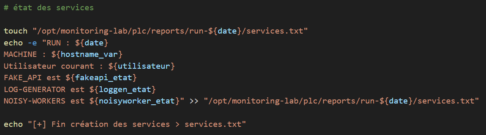
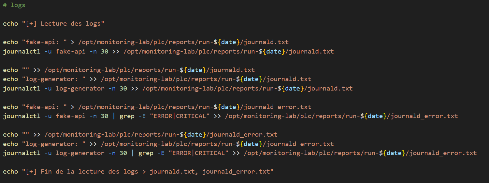
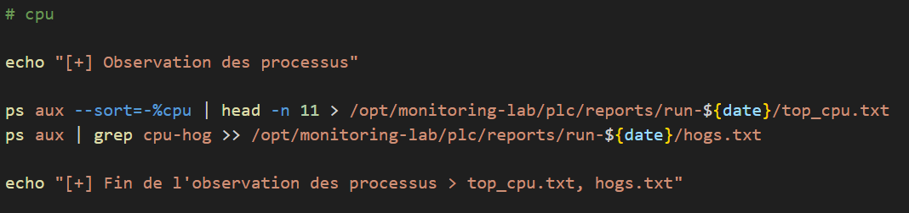
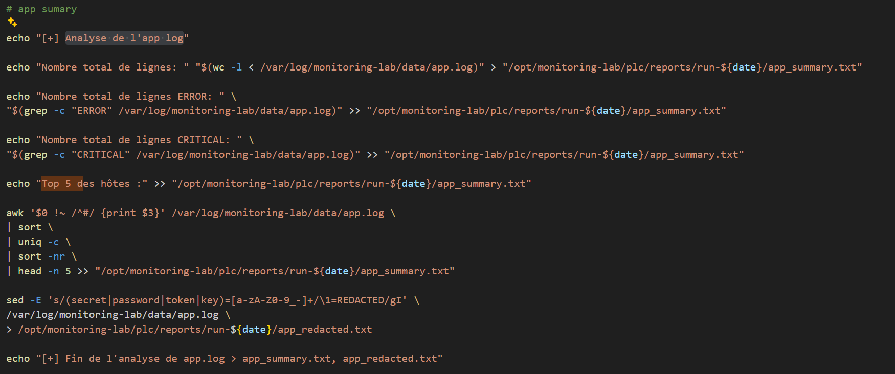
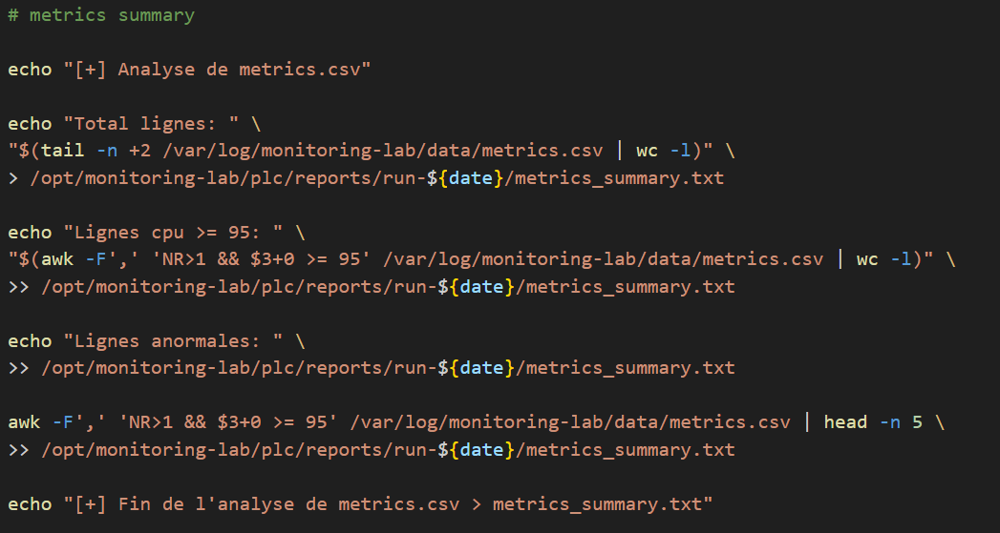
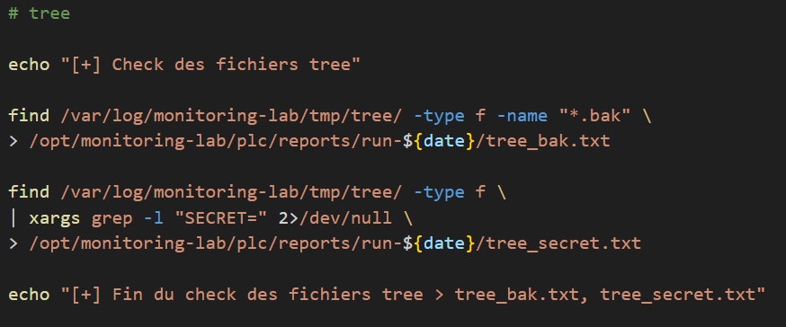
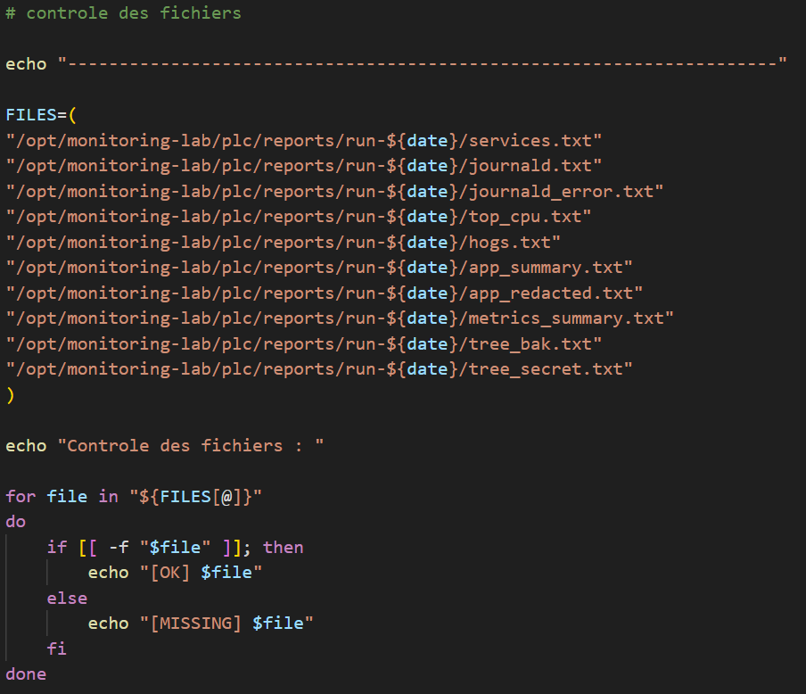

# Script de Monitoring

## Table des matières

- [Installation](#installation)
- [Structure des sorties](#structure-des-sorties)
- [Détail des sections](#détail-des-sections)
  - [1. Initialisation](#1-initialisation)
  - [2. Vérification des services](#2-vérification-des-services)
  - [3. Collecte des logs journald](#3-collecte-des-logs-journald)
  - [4. Observation des processus CPU](#4-observation-des-processus-cpu)
  - [5. Analyse du log applicatif](#5-analyse-du-log-applicatif)
  - [6. Analyse des métriques CSV](#6-analyse-des-métriques-csv)
  - [7. Contrôle des fichiers temporaires](#7-contrôle-des-fichiers-temporaires)
  - [8. Contrôle final des fichiers générés](#8-contrôle-final-des-fichiers-générés)
- [Fichiers générés](#fichiers-générés)
- [Maintenance et personnalisation](#maintenance-et-personnalisation)

---

## Installation

### 1. Création du dossier de travail

```bash
sudo mkdir -p /opt/monitoring-lab/plc
sudo chown -R "$USER":"$USER" /opt/monitoring-lab/plc
cd /opt/monitoring-lab/plc
```

### 2. Récupération du script

Cloner le dépôt ou copier le script dans le dossier de travail :

```bash
git clone <url-du-repo> .
# ou
cp /chemin/vers/monitoring.sh /opt/monitoring-lab/plc/monitoring.sh
```

### 3. Rendre le script exécutable

```bash
chmod +x /opt/monitoring-lab/plc/monitoring.sh
```

### 4. Exécuter le script

```bash
./monitoring.sh
```

---

## Structure des sorties

Chaque exécution crée un répertoire unique sous :

```
/opt/monitoring-lab/plc/reports/run-<YYYY-MM-DD-HH:MM:SS>/
```

---

## Détail des sections

### 1. Initialisation

```bash
hostname
date
whoami
date=$(date +%Y-%m-%d-%T)
hostname_var=$(hostname)
utilisateur=$(whoami)
```

- **`date`** — affichage la date pour la création du dossier du rapport
- **`hostname_var`** — nom d'hôte de la machine
- **`utilisateur`** — nom de l'utilisateur qui exécute le script

### 2. Vérification des services

```bash
systemctl is-active --quiet <service>
```

Chaque service (`fake-api`, `log-generator`, `noisy-workers`) est interrogé via `systemctl`

**Sortie :** `services.txt`

---

---

### 3. Collecte des logs journald

```bash
journalctl -u <service> -n 30
```

Les 30 dernières entrées de journal de `fake-api` et `log-generator` sont collectées.

**Sorties :**

- **`journald.txt`** — logs bruts des deux services (30 lignes chacun)
- **`journald_error.txt`** — uniquement les lignes contenant `ERROR` ou `CRITICAL`, filtrées via `grep -E "ERROR|CRITICAL"`

---

---

### 4. Observation des processus CPU

```bash
ps aux --sort=-%cpu | head -n 11
ps aux | grep cpu-hog
```

**Sorties :**

- **`top_cpu.txt`** — les 10 processus les plus consommateurs de CPU à l'instant de l'exécution
- **`hogs.txt`** — toutes les lignes `ps` correspondant à un processus nommé `cpu-hog`

---

---

### 5. Analyse du log applicatif

```bash
/var/log/monitoring-lab/data/app.log
```

Plusieurs analyses sont effectuées sur ce fichier de log :

**`app_summary.txt`** contient :
- Le nombre total de lignes du fichier
- Le nombre de lignes contenant `ERROR`
- Le nombre de lignes contenant `CRITICAL`
- Le top 5 des hôtes les plus fréquents, extrait via `awk` (colonne 3, hors lignes commentées)

**`app_redacted.txt`** est une copie du log dans laquelle les valeurs sensibles sont masquées :

```bash
sed -E 's/(secret|password|token|key)=[a-zA-Z0-9_-]+/\1=REDACTED/gI'
```

Les paramètres de type `password=abc123`, `token=xyz`, `key=...` sont remplacés par `password=REDACTED`, `token=REDACTED`.

---

---

### 6. Analyse des métriques CSV

```bash
/var/log/monitoring-lab/data/metrics.csv
```

Le fichier CSV est analysé avec `awk`, en ignorant la ligne d'en-tête (`NR>1`).

**`metrics_summary.txt`** contient :
- Le nombre total de lignes de données (hors en-tête)
- Le nombre de lignes où la colonne 3 (CPU) est supérieure ou égale à 95 %
- Les 5 premières lignes anormales (CPU ≥ 95 %)

---

---

### 7. Contrôle des fichiers temporaires

```bash
find /var/log/monitoring-lab/tmp/tree/ ...
```

**Sorties :**

- **`tree_bak.txt`** — liste de tous les fichiers portant l'extension `.bak`
- **`tree_secret.txt`** — liste des fichiers contenant la chaîne `SECRET=` (recherche via `xargs grep -l`)

---

---

### 8. Contrôle final des fichiers générés

```bash
for file in "${FILES[@]}"; do
  if [[ -f "$file" ]]; then echo "[OK] $file"
  else echo "[MISSING] $file"; fi
done
```

En fin de script, une boucle vérifie l'existence de chacun des 10 fichiers attendus dans le répertoire de rapport. Chaque fichier est affiché avec le statut `[OK]` s'il existe, ou `[MISSING]` s'il est absent.

---

---

## Fichiers générés

Tous les fichiers sont créés dans `/opt/monitoring-lab/plc/reports/run-<date>/` :

| Fichier | Contenu |
|---|---|
| `services.txt` | État des 3 services (Ok / Nok) |
| `journald.txt` | 30 derniers logs de `fake-api` et `log-generator` |
| `journald_error.txt` | Logs filtrés sur `ERROR` et `CRITICAL` |
| `top_cpu.txt` | Top 10 des processus par consommation CPU |
| `hogs.txt` | Processus `cpu-hog` détectés |
| `app_summary.txt` | Statistiques et top 5 hôtes du log applicatif |
| `app_redacted.txt` | Log applicatif avec secrets masqués |
| `metrics_summary.txt` | Statistiques CSV et lignes CPU ≥ 95 % |
| `tree_bak.txt` | Fichiers `.bak` dans le répertoire temporaire |
| `tree_secret.txt` | Fichiers contenant `SECRET=` |

---

## Maintenance et personnalisation

### Automatiser l'exécution avec cron

Pour lancer le script automatiquement à intervalles réguliers, ajouter une entrée cron :

```bash
crontab -e
```

Exemple — exécution toutes les heures :
```
0 * * * * /opt/monitoring-lab/plc/monitoring.sh >> /var/log/monitoring-lab/cron.log 2>&1
```

### Nettoyer les anciens rapports

Les rapports s'accumulent à chaque exécution. Pour supprimer automatiquement les rapports de plus de 7 jours :

```bash
find /opt/monitoring-lab/plc/reports/ -type d -name "run-*" -mtime +7 -exec rm -rf {} +
```

Cette commande peut également être ajoutée en cron pour une purge automatique.

### Modifier les services surveillés

Les services vérifiés sont définis en dur dans le script. Pour en ajouter ou remplacer un, localiser les blocs suivants et les adapter :

```bash
# Exemple : remplacer noisy-workers par mon-nouveau-service
if systemctl is-active --quiet mon-nouveau-service
then nouveauservice_etat='Ok'
else nouveauservice_etat='Nok'
fi
```

Penser également à mettre à jour la ligne d'écriture dans `services.txt` pour inclure la nouvelle variable.

### Modifier le nombre de lignes de logs collectées

Par défaut, les 30 dernières lignes de chaque service sont récupérées. Pour ajuster cette valeur, modifier le paramètre `-n` de `journalctl` :

```bash
# Passer à 50 lignes
journalctl -u fake-api -n 50
```

### Modifier le seuil d'alerte CPU

Le seuil de détection des pics CPU est fixé à 95 % dans la section métriques. Pour le modifier :

```bash
# Exemple : abaisser le seuil à 80 %
awk -F',' 'NR>1 && $3+0 >= 80' /var/log/monitoring-lab/data/metrics.csv
```

### Ajouter un nouveau mot-clé à redacter

La redaction des secrets dans `app_redacted.txt` est gérée par cette expression `sed` :

```bash
sed -E 's/(secret|password|token|key)=[a-zA-Z0-9_-]+/\1=REDACTED/gI'
```

Pour ajouter un nouveau mot-clé (ex. `apikey`), l'insérer dans le groupe entre parenthèses :

```bash
sed -E 's/(secret|password|token|key|apikey)=[a-zA-Z0-9_-]+/\1=REDACTED/gI'
```